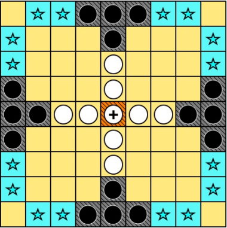

# Tablut
For the Tablut competition 2020/2021

Author: The Tulbat's team

# Tablut Challenge 2020/2021



**_Tablut_** is an ancient viking board game.
The game board is grid of 9x9 squares where two players alternate in moving their pawns:
* attackers (black soldiers) 
* defenders (white soldiers and one king)   

This repository contains an intelligent agent able to play to the game and it was designed to take part in the Tablut Students Challenge 2020/2021 at the University of Bologna.                   
The rules used in this version are known as "Ashton Tablut", explained in these [slides](ChallengeAI20-21.pdf)) and the agent interacts with a Server done by tutor [Andrea Galassi](https://github.com/AGalassi/TablutCompetition).
The language used is Java.

## Strategy adopted

Both white and black players have been implemented using Iterative Deepening search with AlphaBeta Pruning using the Aima library. 
Simple heuristics described in these [brief slides](Tulbat.pdf) guarantee a deep exploration of the game tree.

## Download

First of all, you need to download the project through cloning.

```console
git clone https://github.com/silviazandoli/Tulbat.git
cd Tulbat
```

## Requirements

You need to have JDK >= 16. From Ubuntu console, you can install it with these commands:
```console
sudo apt update
sudo apt install openjdk-16-jdk -y
```

## Run

To start playing, you will simply move in `Executables` directory and run the Server with:
```console
java -jar Server.jar
```
Then you will run either black and white artificial intelligent player:
```console
./runmyplayer black 60 localhost
```
```console
./runmyplayer white 60 localhost
```

You can run players also with different parameters:
```console
./runmyplayer <role> <timeout-in-seconds> <server-ip>
    
    <role> : role of the player in the game (black or white, it is mandatory)
    <timeout-in-seconds> : time taken by the player to find the best moves (default: 60, not mandatory)
    <server-ip> : ip address of the server (default: localhost, not mandatory)

```

## Versioning

We use Git for versioning.

## Group members

 The name of group enrolled in the Tablut Students Challenge 2020/2021 that presented this project is **Tulbat**.
 Components of the team are:
 
 Silvia Zandoli: `silvia.zandoli2@studio.unibo.it`, [_silviazandoli_](https://github.com/silviazandoli).
 
 Federico Cremonini:  `federico.cremonini2@studio.unibo.it`, [_FedericoCremoniniUnibo_](https://github.com/FedericoCremoniniUnibo).
 
 Silvio Russo:  `silvio.russo2@studio.unibo.it` , [_Silvio9889_](https://github.com/Silvio9889).


